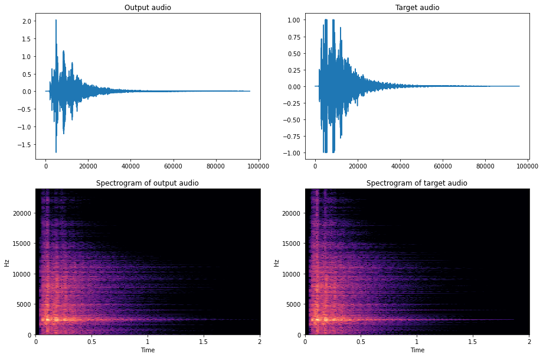

# Parameter Estimation of Reverberation Using a Neural Network

## Feedback Delay Network Reverberator 

A custom implementation of a feedback delay network reverberator has been made as a VST3 using JUCE. 

The source code to the repository can be found [here](https://github.com/VoggLyster/Reverberator), and the latest version compiled for x86_64 Ubuntu 18.04 can be found here 

--- 
## Neural Network
The neural network for estimating the reverberator parameters can be found [here](https://github.com/VoggLyster/Reverberator). The Jupyter Notebook [ReverberatorEstimator.ipynb](https://github.com/VoggLyster/ReverberatorEstimator/blob/main/ReverberatorEstimator.ipynb) contains the setup that has been used to create the network. 

---
## Examples
Two experiments has been made and reported on. Both examples uses a dry and wet finger snapping sound as an input.
[Input sound sample](../Dataset/Dry/New.wav)
### Experiment 1 - "Dark" reverb
The first experiment has been made by using the custom plugin to create a dark sounding reverb sounding like this: [Target sound](../Dataset/Wet/Snap_16ch.wav)

Using this sound as a target the model has been trained until it produced an output sounding like this: [Output sound](./audio/output_audio_d.wav)

The waveforms and spectrograms of the output and target can be seen in the following pictures.

### Experiment 2 - "Bright" reverb
The second experiment has been made by creating a brighter and more metallic sounding reverbed signal: [Target sound](../Dataset/Wet/Snap_16ch_metallic.wav)

Again the model has been trained on the target sound, but this time the model had issues converging to the right result. Though it still converged after 50-something hours the training was cut short. 
The current output sound can be heard here: [Output sound](./audio/output_audio_b.wav)

The waveforms and spectrograms of the output and target can be seen in the following pictures.
